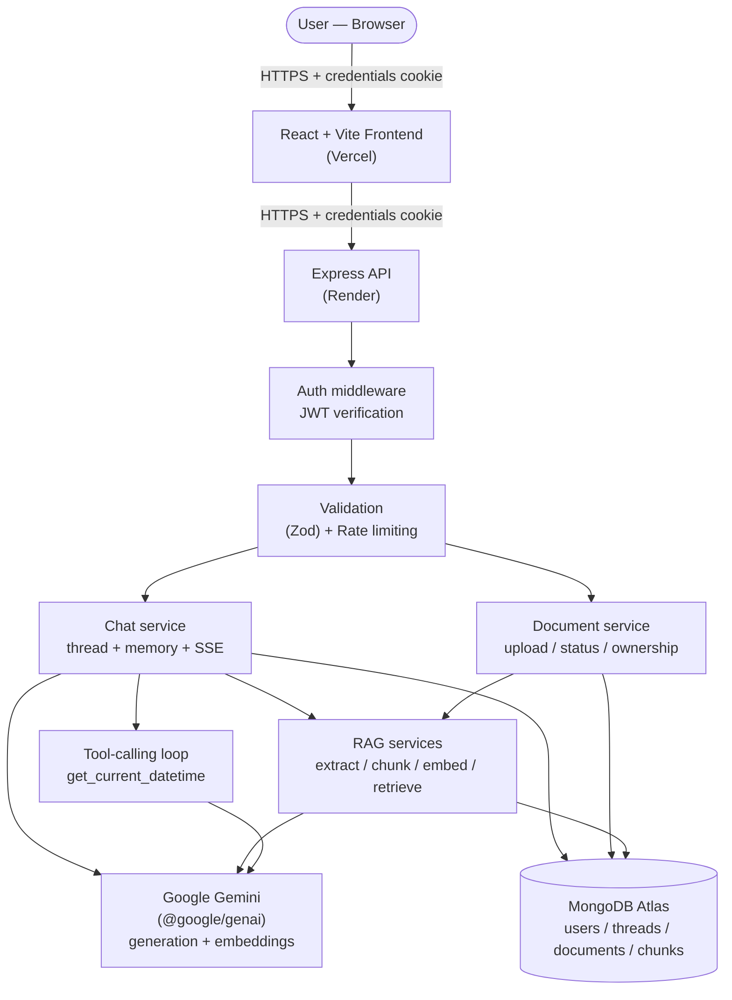
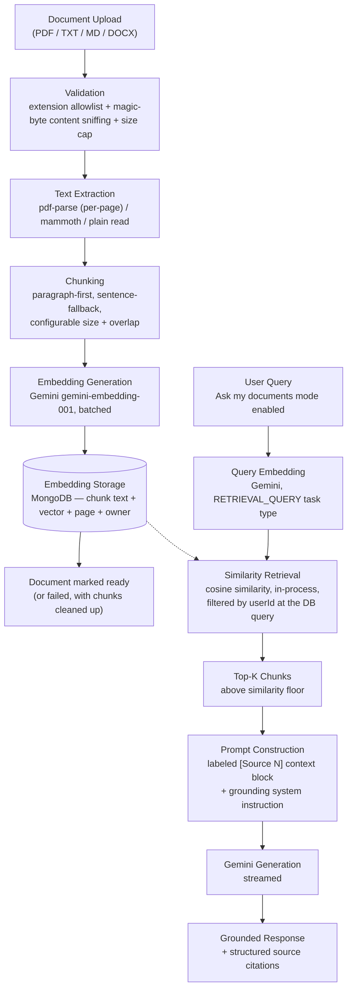
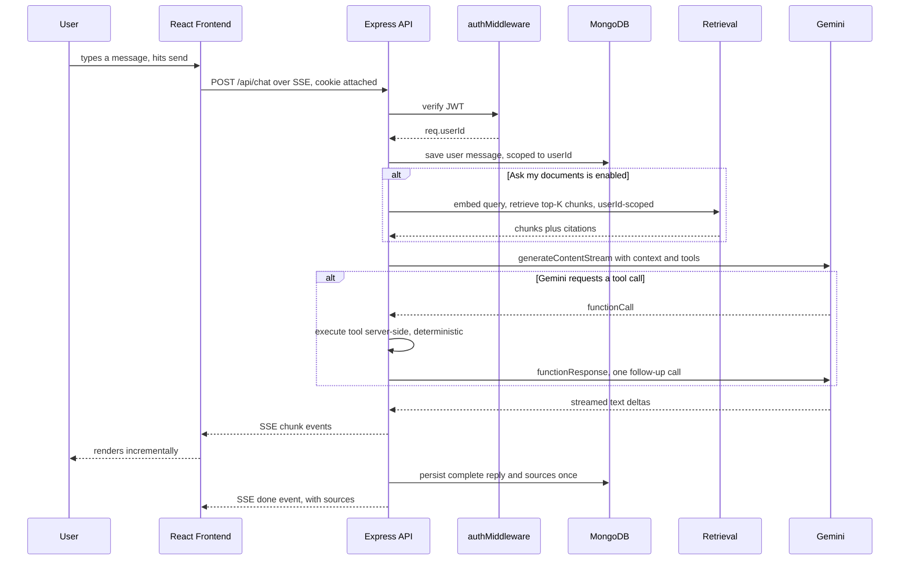
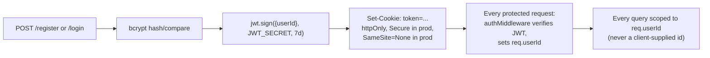

# SynapseAI

An AI-powered knowledge assistant that combines authenticated conversational chat, persistent multi-turn threads, Retrieval-Augmented Generation over user-uploaded documents, and Gemini tool/function calling — with the same production concerns (ownership isolation, rate limiting, structured error handling, CI) a real product would need, not just a demo.


---

## Table of Contents

1. [Project Overview](#1-project-overview)
2. [Key Features](#2-key-features)
3. [System Architecture](#3-system-architecture)
4. [RAG Pipeline](#4-rag-pipeline)
5. [AI Chat Flow](#5-ai-chat-flow)
6. [Authentication Architecture](#6-authentication-architecture)
7. [Technology Stack](#7-technology-stack)
8. [Project Structure](#8-project-structure)
9. [API Overview](#9-api-overview)
10. [Testing](#10-testing)
11. [Local Setup](#11-local-setup)
12. [Environment Variables](#12-environment-variables)
13. [Deployment](#13-deployment)
14. [Security Considerations](#14-security-considerations)
15. [Engineering Challenges / Technical Decisions](#15-engineering-challenges--technical-decisions)
16. [Future Improvements](#16-future-improvements)
17. [Screenshots](#17-screenshots)
18. [License](#18-license)

---

## 1. Project Overview

SynapseAI is a private, account-based chat application built on Google Gemini. It started as a conversational chat app and grew into something closer to a knowledge platform: users can upload their own documents (PDF, TXT, Markdown, DOCX) and ask questions that are answered *grounded in that content*, with the response citing exactly which document and page the answer came from.

What makes it more than a wrapper around an LLM API:

- **Real multi-turn memory** — the model receives a bounded window of actual prior conversation on every turn, not just the latest message.
- **Real Retrieval-Augmented Generation** — documents are extracted, chunked, embedded with Gemini's embedding model, and retrieved by cosine similarity at query time; nothing is faked or simulated.
- **Real streaming** — responses render token-by-token via Server-Sent Events as Gemini generates them.
- **Real tool use** — Gemini can call a server-executed function mid-conversation when the question needs it.
- **Real multi-tenancy** — every thread, document, and chunk is scoped to its owning user at the database-query level, verified by dedicated cross-user isolation tests.

It's intended as a portfolio/resume project that demonstrates end-to-end AI product engineering: not just "call the LLM API," but the surrounding system — auth, data modeling, retrieval, security, testing, and deployment — that separates a prototype from something closer to shippable.

## 2. Key Features

| Feature | Status |
|---|---|
| Email/password auth with JWT + httpOnly cookies | ✅ Implemented |
| Persistent per-user chat threads (create/switch/delete) | ✅ Implemented |
| Real conversation memory (bounded context window) | ✅ Implemented |
| Real-time SSE streaming responses | ✅ Implemented |
| Stop/abort an in-progress generation | ✅ Implemented |
| Document upload (PDF / TXT / Markdown / DOCX) | ✅ Implemented |
| Text extraction (per-page for PDFs) | ✅ Implemented |
| Semantic chunking (paragraph/sentence-aware, configurable) | ✅ Implemented |
| Real Gemini embeddings (`gemini-embedding-001`) | ✅ Implemented |
| Cosine-similarity semantic retrieval, ownership-scoped | ✅ Implemented |
| RAG-grounded answers with structured source citations | ✅ Implemented |
| Gemini function/tool calling (`get_current_datetime`) | ✅ Implemented |
| Per-user document/thread data isolation | ✅ Implemented |
| Rate limiting (auth / chat / document upload) | ✅ Implemented |
| Request validation (Zod) on every mutating route | ✅ Implemented |
| File upload validation (extension + magic-byte content sniffing + size cap) | ✅ Implemented |
| Security headers (Helmet) + strict single-origin CORS | ✅ Implemented |
| Dark/light theme, responsive layout | ✅ Implemented |
| Toast notification system (deduplicated) | ✅ Implemented |
| Automated test suite (backend + frontend) | ✅ Implemented |
| CI (GitHub Actions: tests + lint + build on every push) | ✅ Implemented |
| Deployed (Vercel + Render + MongoDB Atlas) | ✅ Implemented |
| Dedicated vector database | ❌ Not implemented (deliberate — see [§15](#15-engineering-challenges--technical-decisions)) |
| Multi-tool/agentic framework | ❌ Not implemented (one tool, deliberately scoped — see [§15](#15-engineering-challenges--technical-decisions)) |

## 3. System Architecture



Frontend and backend are independently deployed on different origins; the backend is a normal long-running Express process on Render (not serverless), reachable at a fixed URL with a `GET /health` endpoint for host health checks. **The frontend never talks to MongoDB or Gemini directly** — every protected operation goes through the Express API.

## 4. RAG Pipeline



Each stage is a separate, independently-tested module (`services/textExtraction.js`, `chunking.js`, `embeddingService.js`, `retrieval.js`, `ragPrompt.js`) — not one large function — so each is unit-testable in isolation and swappable later.

**Why cosine similarity in-app instead of a vector database.** MongoDB Atlas Vector Search was evaluated and is the natural upgrade path, but wasn't used: it requires a manually-created Atlas Search index that can't be verified from the codebase, and its `$vectorSearch` aggregation stage doesn't run against the in-memory MongoDB the test suite uses — which would make retrieval untestable without a live Atlas cluster. Instead, chunk embeddings are stored as plain number arrays and similarity is computed in the Node process over chunks the MongoDB query has already scoped to the requesting user. This adds zero infrastructure and is fully unit-testable, at the documented cost of reading every one of a user's chunks per query — appropriate at a personal/small-team document-set scale, and isolated behind one module (`services/retrieval.js`) if it ever needs to change.

## 5. AI Chat Flow



Conversation memory is a bounded sliding window (`MAX_CONTEXT_MESSAGES`, default 20) of the thread's own messages — not the full history — so a long-running thread doesn't grow the request payload or token usage indefinitely.

## 6. Authentication Architecture



- Passwords are hashed with **bcrypt** — never stored or compared as plaintext.
- The JWT is transmitted **only** via the httpOnly cookie — never in a JSON response body, never readable by frontend JavaScript.
- `secure`/`sameSite` cookie flags are environment-aware: production (Vercel frontend ↔ Render backend, different origins) requires `SameSite=None; Secure`; local dev (same-origin via the Vite proxy) uses `SameSite=Strict`.
- `authMiddleware` is the single source of `req.userId` for every protected route — no route trusts a client-supplied user identifier for authorization.
- Session restoration on page reload works via `GET /api/auth/me` (which succeeds/fails based on the cookie the browser sends automatically) — the frontend never attempts to read the cookie itself, because it can't.

## 7. Technology Stack

**Frontend**

| Technology | Role |
|---|---|
| React 19 | UI |
| Vite 7 | Dev server + build |
| Axios | REST API calls (auth, threads, documents) |
| `fetch` + `ReadableStream` | SSE consumption for streamed chat (Axios doesn't support streaming responses the way this needs) |
| React Markdown + rehype-highlight + highlight.js | Markdown/code rendering in chat |
| Font Awesome | Iconography |
| uuid | Client-generated thread IDs |

**Backend**

| Technology | Role |
|---|---|
| Node.js + Express 5 | HTTP API |
| Mongoose (MongoDB) | Data modeling/persistence |
| jsonwebtoken | JWT signing/verification |
| bcryptjs | Password hashing |
| Zod | Request body validation |
| express-rate-limit | Rate limiting |
| Helmet | Security headers |
| cors | Origin-restricted CORS |
| multer | Multipart file upload (in-memory only) |
| pdf-parse / mammoth | PDF / DOCX text extraction |

**AI/ML**

| Technology | Role |
|---|---|
| `@google/genai` (Google Gemini) | Chat generation (`gemini-3-flash-preview`), embeddings (`gemini-embedding-001`), function calling — single provider for everything AI-related |

**Database**

| Technology | Role |
|---|---|
| MongoDB Atlas | Users, threads (with embedded messages), documents, chunks (with embedding vectors) |

**Testing**

| Technology | Role |
|---|---|
| Vitest | Test runner, both packages |
| Supertest | Backend HTTP integration tests |
| mongodb-memory-server | Real (in-memory) MongoDB for backend tests — no mocked DB layer |
| React Testing Library | Frontend component tests |

**Deployment / DevOps**

| Technology | Role |
|---|---|
| Vercel | Frontend hosting |
| Render | Backend hosting (persistent Node web service) |
| GitHub Actions | CI — tests + lint + build on every push/PR |

**Developer tooling**

| Technology | Role |
|---|---|
| ESLint | Frontend linting |
| nodemon | Backend dev auto-restart |

## 8. Project Structure

```
SynapseAI/
├── Backend/
│   ├── server.js                 # Entry point, middleware, health check, startup
│   ├── config/rag.js              # All RAG/document-pipeline tuning constants
│   ├── middleware/
│   │   ├── auth.js                # JWT verification
│   │   ├── validate.js            # Zod request-body validation
│   │   └── rateLimiter.js         # Auth + chat + document-upload rate limits
│   ├── models/
│   │   ├── User.js / Thread.js
│   │   └── Document.js / Chunk.js
│   ├── routes/
│   │   ├── auth.js / chat.js (normal + RAG-augmented) / documents.js
│   ├── services/
│   │   ├── textExtraction.js, chunking.js, embeddingService.js
│   │   ├── documentProcessing.js  # Orchestrates extract → chunk → embed → persist
│   │   ├── retrieval.js           # Ownership-scoped cosine-similarity search
│   │   ├── ragPrompt.js           # Grounding system instruction + prompt building
│   │   └── tools.js               # Function-calling tool declarations + executors
│   ├── utils/gemini.js            # Streaming, context building, tool-call loop
│   └── tests/                     # Vitest + Supertest integration tests
│
├── Frontend/src/
│   ├── App.jsx                    # Auth bootstrap, theme, top-level view
│   ├── Sidebar.jsx / ChatWindow.jsx / Chat.jsx
│   ├── DocumentsPanel.jsx         # Upload / status / delete
│   ├── api/documents.js           # Documents API client
│   ├── ToastProvider.jsx          # Deduplicated notification system
│   ├── AuthScreen.jsx / AuthPanel.jsx
│   └── tests/                     # Vitest + React Testing Library
│
├── docs/ARCHITECTURE.md           # Deeper flow-by-flow architecture reference
└── .github/workflows/ci.yml       # CI: backend tests, frontend tests/lint/build
```

## 9. API Overview

**Auth** — `/api/auth`

| Method | Route | Auth | Purpose |
|---|---|---|---|
| POST | `/register` | No | Create an account |
| POST | `/login` | No | Log in, receive session cookie |
| POST | `/logout` | No | Clear the session cookie |
| GET | `/me` | ✅ | Get the current authenticated user |
| PUT | `/theme` | ✅ | Update theme preference |

**Threads & Chat** — `/api`

| Method | Route | Auth | Purpose |
|---|---|---|---|
| GET | `/thread` | ✅ | List the current user's threads |
| GET | `/thread/:threadId` | ✅ | Get a thread's messages |
| DELETE | `/thread/:threadId` | ✅ | Delete a thread |
| POST | `/chat` | ✅ | Send a message; streams the reply over SSE. Optional `useKnowledge`/`documentIds` enable RAG for that turn |

**Documents (RAG)** — `/api/documents`

| Method | Route | Auth | Purpose |
|---|---|---|---|
| POST | `/` | ✅ | Upload a document (multipart); returns immediately with `status: "processing"` |
| GET | `/` | ✅ | List the current user's documents |
| GET | `/:id` | ✅ | Get one document's status/metadata |
| DELETE | `/:id` | ✅ | Delete a document and its chunks |

**Other**

| Method | Route | Auth | Purpose |
|---|---|---|---|
| GET | `/health` | No | Liveness check, independent of DB state |

## 10. Testing

**Framework**: Vitest across both packages — Supertest + a real in-memory MongoDB (`mongodb-memory-server`) for backend integration tests, React Testing Library for frontend component tests.

**What's covered**:
- Auth: registration/login validation, session lifecycle, password hashing
- Threads: CRUD, cross-user isolation
- Chat: SSE streaming, persistence, conversation-memory window construction, rate limiting
- RAG: text extraction (valid/empty/unsupported/corrupted documents), chunking (short/long text, overlap, page metadata), the embedding service (batching, ordering, error mapping), retrieval (real DB + deterministic fake vectors — ranking, similarity floor, top-K, ownership isolation), the documents API (upload validation, full processing pipeline to `ready`, cascading delete), RAG-augmented chat (prompt construction, citation propagation, graceful retrieval failure)
- Document processing failure handling: embedding failure, unextractable documents, and a partial-failure race that could otherwise leave orphaned chunks
- Function calling: tool execution, argument validation, error handling, the full call → execute → follow-up loop
- Frontend: SSE stream consumption, the "Ask my documents" toggle, login/register form, sidebar delete confirmation, Documents panel states, source-citation rendering, toast deduplication

**No test makes a real Gemini API call** — every AI call (generation, embeddings) is mocked with deterministic fixtures, so the suite is unaffected by API quota and runs identically in CI.

```bash
cd Backend && npm test          # Vitest + Supertest, in-memory MongoDB
cd Frontend && npm test         # Vitest + React Testing Library
cd Frontend && npm run lint     # ESLint
cd Frontend && npm run build    # Production build
```

**CI**: `.github/workflows/ci.yml` runs all of the above on every push/PR to `main`, as two independent jobs (backend, frontend), requiring no repository secrets.

## 11. Local Setup

**Prerequisites**: Node.js 20+, a MongoDB connection string (local or [Atlas](https://www.mongodb.com/cloud/atlas)), a [Gemini API key](https://aistudio.google.com/).

```bash
git clone https://github.com/Jaineel22/synapseai-conversational-platform.git
cd synapseai-conversational-platform

# Backend
cd Backend
npm install
cp .env.example .env      # fill in real values — never commit .env
npm run dev                # http://localhost:8080

# Frontend (separate terminal)
cd Frontend
npm install
npm run dev                 # http://localhost:5173, proxies /api to localhost:8080

# Tests
cd Backend && npm test
cd Frontend && npm test && npm run lint && npm run build
```

## 12. Environment Variables

Names and placeholders only — see `Backend/.env.example` / `Frontend/.env.example` for full details. **Never commit real values.**

**Backend**

| Variable | Required | Purpose |
|---|---|---|
| `MONGODB_URI` | ✅ | `mongodb+srv://<user>:<password>@<cluster>/...` |
| `JWT_SECRET` | ✅ | Random secret for signing JWTs |
| `GEMINI_API_KEY` | ✅ | Google Gemini API key |
| `CLIENT_ORIGIN` | ✅ | Exact frontend origin, for CORS |
| `NODE_ENV` | Effectively yes | Controls cookie `secure`/`sameSite` flags |
| `PORT` | No | Defaults to 8080 |
| `MAX_CONTEXT_MESSAGES`, `GEMINI_TIMEOUT_MS` | No | Chat tuning |
| `AUTH_RATE_LIMIT`, `CHAT_RATE_LIMIT`, `DOCUMENT_UPLOAD_RATE_LIMIT` | No | Rate-limit tuning |
| `EMBEDDING_MODEL`, `EMBEDDING_DIMENSIONS`, `EMBEDDING_BATCH_SIZE` | No | Embedding tuning |
| `RAG_CHUNK_SIZE`, `RAG_CHUNK_OVERLAP`, `RAG_MIN_CHUNK_SIZE` | No | Chunking tuning |
| `RAG_TOP_K`, `RAG_MIN_SIMILARITY`, `RAG_MAX_CHUNK_CHARS_IN_PROMPT` | No | Retrieval tuning |
| `DOCUMENT_MAX_FILE_SIZE_MB` | No | Upload size cap |

**Frontend**

| Variable | Required | Purpose |
|---|---|---|
| `VITE_API_URL` | No in dev | Backend origin. Empty locally (Vite proxy handles it); the deployed backend's URL in production, set in the hosting platform's dashboard — never hardcoded |

## 13. Deployment

```
Frontend  →  Vercel   (static Vite build; VITE_API_URL baked in at build time)
Backend   →  Render   (persistent Node/Express web service, GET /health)
Database  →  MongoDB Atlas
AI        →  Google Gemini API (@google/genai)
```

- The frontend and backend are on different origins in production; CORS on the backend is locked to the exact frontend origin (`CLIENT_ORIGIN`), never a wildcard.
- `VITE_API_URL` is a **build-time** variable — changing it in the hosting dashboard requires a new deployment to take effect, since Vite bakes it into the static bundle.
- No manual vector-database index/dashboard configuration is required — retrieval runs in-app against the same MongoDB connection every other feature uses.
- Document uploads are processed entirely in memory; nothing is written to Render's (ephemeral) filesystem, so no persistent disk or object storage is required.

## 14. Security Considerations

- **Authentication**: JWT in an httpOnly cookie (never readable by JS, never returned in a response body), bcrypt-hashed passwords, environment-aware `secure`/`sameSite` cookie flags.
- **Authorization / data isolation**: every thread, document, and chunk query is scoped to `req.userId` **at the database query itself** — never as an app-layer filter applied after fetching. Covered by dedicated cross-user isolation tests (a user cannot read, modify, retrieve, or cite another user's threads, documents, or chunks).
- **CORS**: a single explicit origin with credentials enabled, never a wildcard.
- **Input validation**: Zod schemas on every mutating route; file uploads are validated by extension allowlist **and** magic-byte content sniffing (the client-declared MIME type is never trusted alone), plus a hard size cap.
- **Rate limiting**: independent limits on auth (per-IP), chat (per-account), and document upload (per-account), sized to the actual resource being protected.
- **Prompt-injection boundary**: the RAG system instruction explicitly tells Gemini that retrieved document content is untrusted *data*, not instructions — a real, documented mitigation, not a claim of immunity.
- **Error handling**: a consistent `{ error: "..." }` response shape; unexpected server errors are logged in full server-side but only ever return a generic message to the client — no stack traces, driver messages, or internals leak into a response.
- **Secrets**: `.env` is gitignored and was never committed; `.env.example` files contain only variable names, no values. No Gemini key, JWT secret, or MongoDB credential is ever reachable from frontend code.

This is a solid baseline for a portfolio/resume project, not a claim of enterprise-grade security certification — there is no automated dependency-vulnerability scanning, no WAF, and no penetration testing has been performed.

## 15. Engineering Challenges / Technical Decisions

- **Why RAG instead of just stuffing documents into the prompt.** Full documents don't fit in a context window reliably or cheaply. Chunking + retrieval means only the handful of passages actually relevant to a given question are sent to the model, keeping cost and latency bounded regardless of how much a user has uploaded.
- **Why chunking is paragraph-first with a sentence-level fallback**, not a fixed-character split. A naive N-character split can cut a sentence in half, splitting its meaning across two chunks that then get embedded (and potentially retrieved) independently, degrading retrieval quality. Splitting on natural boundaries (falling back to sentences only when a paragraph alone exceeds the chunk size) keeps each chunk's embedding representative of one coherent idea.
- **Why in-app cosine similarity instead of a vector database** — see [§4](#4-rag-pipeline). The short version: it keeps the whole system on infrastructure already in use, is fully testable without a live external service, and is an appropriate tradeoff at this project's scale — with the retrieval module isolated so it could be swapped later.
- **Why retrieval happens before the SSE stream opens.** A retrieval failure (embedding quota exhausted, a transient DB error) can then be reported as a normal JSON error response, exactly like every other pre-generation failure, instead of inventing an SSE-only failure mode for one specific error class.
- **Why user isolation is enforced at the query, not after fetching.** Filtering "after the fact" means another user's data was still loaded into the process at some point — a bug in the filter step, or a forgotten filter on a new endpoint, becomes a real data leak. Scoping every query by `userId` up front means there's no code path where that data is ever in memory to begin with.
- **Why function calling is one tool, not a general agent framework.** The goal was to demonstrate that the Gemini integration supports real tool use — deterministic, server-executed, validated — without taking on the complexity and failure surface of a multi-step agent loop. The tool-calling logic lives entirely inside the existing streaming generator (`utils/gemini.js`), so it never touches the RAG prompt-construction code or the SSE consumption logic in the route handler; adding a second tool means adding one declaration and one executor function, nothing else changes.
- **Why frontend and backend are deployed and reasoned about completely separately.** Vercel (static frontend) and Render (persistent backend process) have different operational models — the backend needed a real long-running process for SSE streaming, which a typical serverless function model handles poorly (cold starts, execution time limits). Keeping them as genuinely separate deployments, communicating only over HTTPS with cookie-based auth, also forced explicit handling of cross-origin cookies/CORS rather than letting a same-origin setup paper over it.

## 16. Future Improvements

*(Not implemented — listed for transparency, not to imply they exist today.)*

- MongoDB Atlas Vector Search (or another vector store) if retrieval volume outgrows in-app cosine similarity
- Background job queue for document processing instead of an in-process async task, if upload volume grows
- Reranking / hybrid (keyword + semantic) retrieval for better precision on ambiguous queries
- Retrieval evaluation metrics (precision/recall against a labeled query set) — none are currently measured
- Additional Gemini tools beyond the current single deterministic utility
- Frontend code-splitting (the production bundle currently exceeds the default 500kB chunk-size guideline)
- Structured/centralized log aggregation (current logging is lightweight `console.*` with category prefixes, not a log pipeline)

## 17. Screenshots

Not currently included in this repository.

## 18. License

No license file is currently included in this repository. All rights reserved by default under standard copyright unless/until a license is added.
